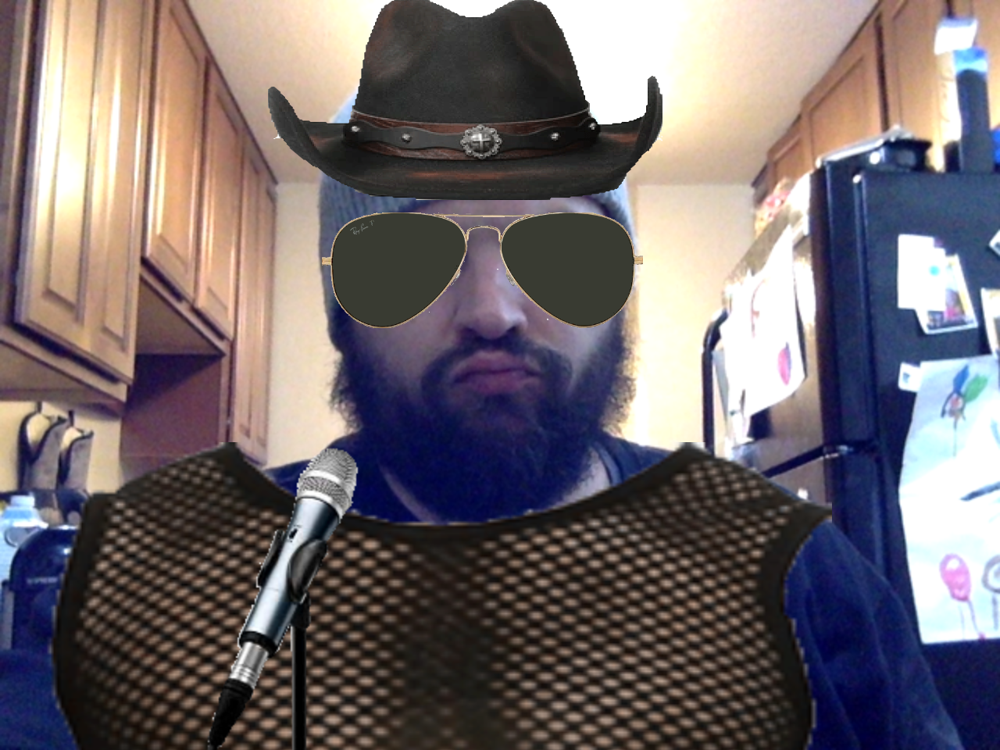
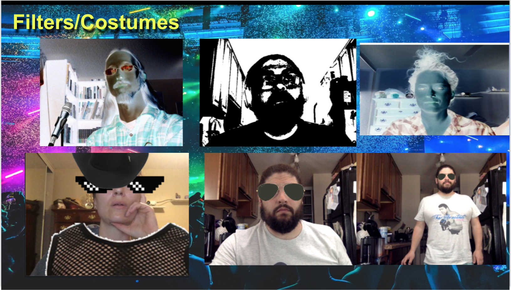

   

# 
 **k{AR}aoke** 

--- 

--- 

## **Table Of Contents** 

---

1. [Description](#description)
2. [Installation](#installation)
3. [Usage](#usage)
4. [Contributing](#contributing)
5. [Review and Contribute](#github)
--- 

## 
  **Description** 
 

--- 

k{AR}aoke features song and lyric videos with an Augmented Reality twist.  Each song has a unique effect that makes you the star of a real-time music video!  Be sure to refresh time after time so you can perform all four songs.  Dont want the fun to end?  Take a screenshot during your performance so you can relive that aha! moment!

--- 
 
## 
  **Installation** 

--- 
 
The app is deployed at the Heroku link listed below but if you wish to install it locally and contribute simply,
<ol>
 <li>Clone the repo and fire npm i in the command line.</li>
 <li>Next, input npm run seed in order to seed the database with the costumes and filters and songs</li>
 <li>  Finally, npm start will run the application and bring up the local host in the browser.</li>
 </ol>

--- 

## 
  **Usage** 

--- 

<ol>
<li>First you will need to create a user name and password. </li>
<li> Then, login will take you to the stage page.  Here the canvas will be displayed along with a carousel of all of your song selections.  </li>
<li>To get started pick a song!  This will automatically set the stage with either the props used in that scene, or a specific filter with which to perform in.</li> 
<li> If you would like to start over, the refresh button brings back the song selection wheel component.</li>
<li>  If you would like to take a screen shot the button to the left will take a snapshot and save it to your local machine. </li>
<li> If you would like to logout hit the next button to be taken back to the login page.</li>
</ol>

--- 

## 
  **Contributing** 

--- 

Pull requests are always welcome. When contributing to this repository, please first discuss the change you wish to make via email or issue.
After approval, please follow the "fork-and-pull" Git workflow.
<ul>
<li>Fork the repo on GitHub</li>
<li>Clone the project to your own machine</li>
<li>Commit changes to your own branch</li>
<li>Push your work back up to your fork</li>
<li>Submit a Pull request so that we can review your changes</li>
</ul>

--- 

## 
 **Review and Contact Developers Here**

___

### _Github:_ [k{AR}oke](https://github.com/Athear/kARaoke)

### _Heroku Deployment:_ (https://just-duet-karaoke.herokuapp.com)
### _Contributors:_
Chris Gutierrez - cmgson1@gmail.com 
Carolyn Hilpisch - ckhilpisch@gmail.com 
Jennifer Nelson -  jennifer.nelson242@gmail.com 
Markki Meyer - markkimeyer@gmail.com 
Todd Malone - toddomalone@gmail.com 

--- 
